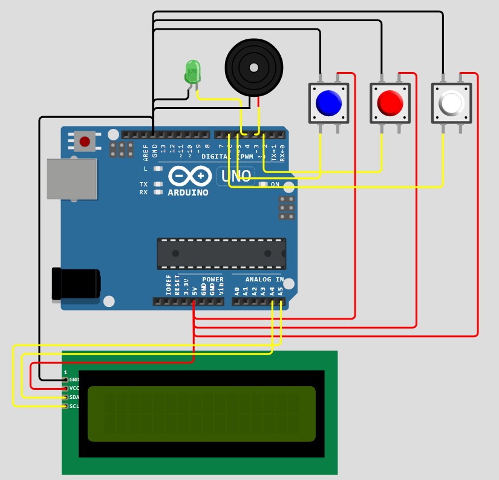
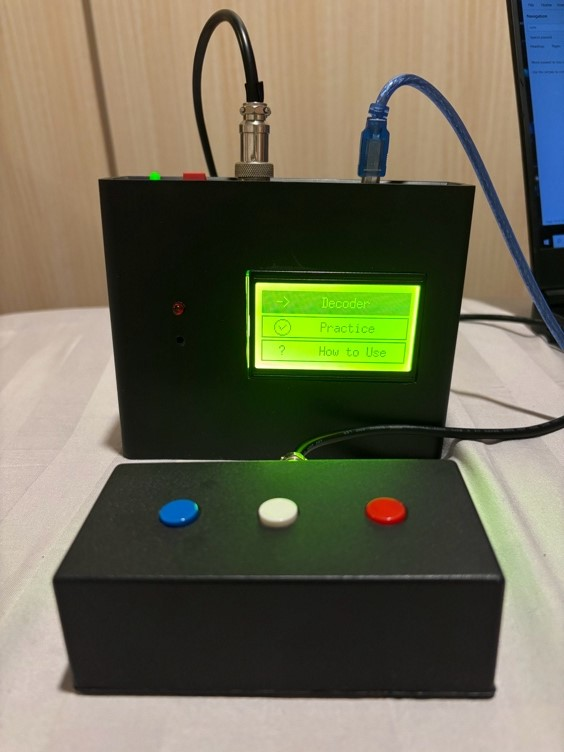

## Description
> An interactive Morse Code Trainer built with an Arduino Uno. It includes features such as Morse Code decoding, WPM counting, and practice modes for individual letters and words. The way the user types in Morse Code and the way the WPM is counted follows International Morse Code standards.

  
Read the full documentation:

 

## Circuit Diagram

 
Note: The actual LCD used is an ST7920 128x64 LCD. Circuit makers do not support this type of LCD for making circuit diagrams, so I have used an I2C 16x2 LCD as a placeholder.
 

## Final Product

